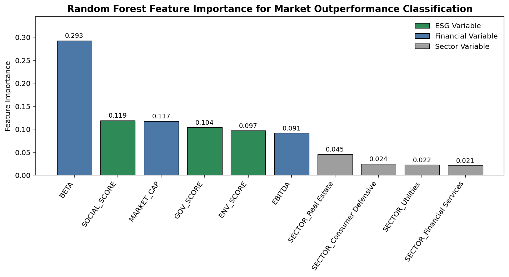
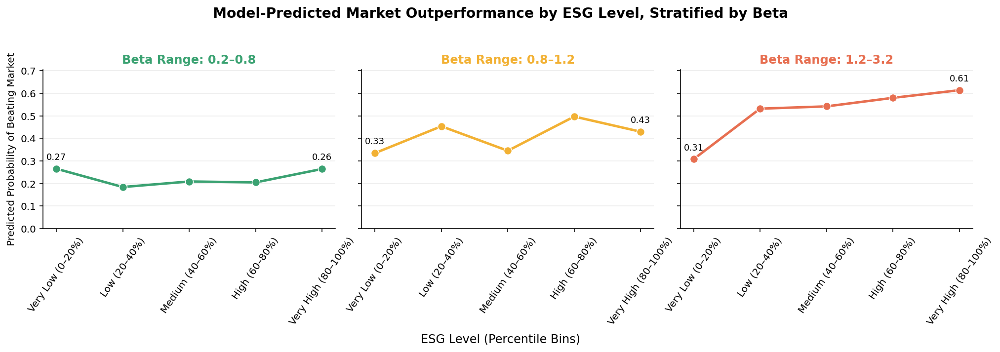

# ESG Scores and S&P 500 Stock Performance

## Overview

This project examines whether Environmental, Social, and Governance (ESG) factors help explain or predict short-term stock performance among S&P 500 companies.

Using financial, ESG, and sector data, our team applied feature selection, PCA, clustering, regression, decision trees, and Random Forest classification to identify the factors most associated with market outperformance.

This was completed as a team project for a Data Mining & Machine Learning course. My primary contribution focused on the Random Forest modeling and analysis of how ESG interacts with financial risk (Beta).

## Business Question

Do ESG scores have a meaningful relationship with short-term stock performance, and can they improve predictions of whether an S&P 500 company will outperform the market?

## Data

The final analysis included 385 S&P 500 companies after data cleaning, with variables covering:

- Environmental, Social, and Governance scores
- Beta
- Market capitalization
- EBITDA
- Sector classifications
- One-year stock returns

Stocks with one-year returns above the S&P 500 benchmark of 24% were classified as having beaten the market.

## Methods

- Data cleaning and preprocessing
- Feature selection
- Principal Component Analysis (PCA)
- K-Means and hierarchical clustering
- Linear and logistic regression
- Decision tree classification
- Random Forest classification
- Cross-validation
- Feature importance analysis

## Random Forest Results

The Random Forest model achieved:

- **ROC-AUC:** 0.81
- **Accuracy:** 70.1%
- **Cross-validated ROC-AUC:** 0.76

Beta was the strongest individual predictor of market outperformance. ESG variables collectively contributed meaningful predictive information alongside traditional financial variables.

### Feature Importance

## ESG and Financial Risk

The analysis also examined model-predicted market outperformance across ESG levels and different ranges of Beta.

For higher-Beta stocks, predicted outperformance increased substantially across ESG levels, while ESG had a much smaller relationship with predicted performance among lower-Beta stocks.

## Project Files

- `random_forest_analysis.py` — Random Forest modeling, evaluation, feature importance, and ESG/Beta analysis
- `clustering_analysis.py` — K-Means and hierarchical clustering
- `model_comparison.py` — regression and classification model comparison
- `esg_selected_features.csv` — modeling dataset
- `final-presentation.pdf` — complete team project presentation

## Tools

**Python** | pandas | scikit-learn | Matplotlib | Machine Learning | PCA | Clustering | Classification
